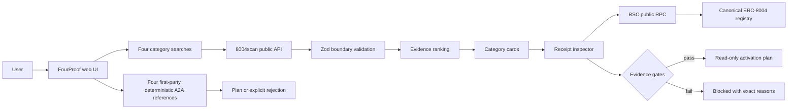

# Architecture and evidence flow

## Observed facts versus claims

| Field | Treatment |
| --- | --- |
| Agent name and description | Publisher claim; used only for category relevance |
| Chain ID, registry address, token ID | Indexed fact, then directly verifiable on BSC |
| `ownerOf(tokenId)` and `tokenURI(tokenId)` | Direct live chain read |
| A2A/MCP discovery URL | Published metadata; not evidence that the execution target works |
| Discovery health | Scanner observation that an AgentCard or MCP document is readable |
| Domain verification | Scanner observation; required but not equivalent to an execution check |
| Execution target | Must be resolved from discovery metadata and pass a bounded public-call check |
| Wallet address | Published metadata; not proof of balance or authorization |
| Returns, win rate, safety, and output quality | Never inferred; require separate task evidence |

## Ranking rationale

Category relevance is deliberately separate from evidence quality. A highly relevant description can make an agent eligible for a category list, but it cannot produce an operational tier without registry, protocol, discovery-domain, execution-target, and wallet evidence.

The score is explainable and capped at 100:

- category relevance: up to 30;
- canonical BSC registry: 20;
- A2A or MCP protocol: 10;
- discovery URL published: 5;
- discovery health: up to 15;
- verified discovery domain: 5;
- validated execution target: 10;
- metadata completeness: up to 10;
- agent wallet: 5;
- feedback volume: up to 5.

The UI presents the underlying facts and blocking reasons, not only the aggregate number.

## Activation boundary

The current MVP generates a local read-only intent only after every evidence gate passes, including a fresh direct BSC owner read. It does not send the intent or move funds. A readable AgentCard alone never passes the gate. A real contest activation path should use an injected user wallet and the official BNB Agent SDK/ ERC-8183 contracts, with the final contract address, token, amount, allowance, expiry, and transaction simulation visible before signature.

## Reference-agent boundary

The four first-party A2A routes are deterministic calculators, not autonomous traders. Each accepts only bounded structured inputs, returns JSON data, and declares read-only/no-custody/no-trading controls. They make the four-category demo reproducible without converting an unregistered service into an onchain identity claim. Deployment and ERC-8004 registration are separate states.
